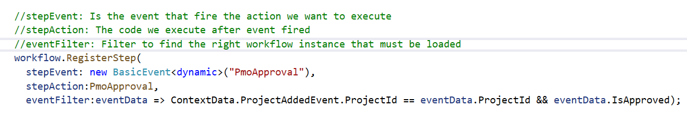

# Why this project?
I want to write workflow in code.
I evaluated the existing solutions and found that there is no solution that fits all scenario
* [MassTransit](https://masstransit-project.com/)
* [Durable Task Framework](https://github.com/Azure/durabletask)
* [D-Async](https://github.com/Dasync/Dasync)

All are intelligent but do not solve the problem well

# How?
* External events occurred
* We define a workflow based on the events in code
* The workflow engine subscribes to events and when an event is received it searches for the workflows that are related to that event
* The engine will get the active running instances for each matched workflow, and for each instance, the engine will check if the instance waits for the event received.
* If the workflow instance already waits for the future event the workflow engine will run/resume the workflow step related.
* If the event is a start event then the engine will start a new instance of the matched workflows.
* If the event didn’t match with any instance then the engine will add it to the errors queue

# The main parts to define a workflow in code are:
## External Events
* Any pub/sub event like (RabbitMQ, Redis Pub/Sub, Service Bus,...etc)
* The engine will provide an API to inject/add/append event directly, this will enable me (as an example) to write a job/service that monitors a legacy system database log and send events directly to the engine. 

## Commands
Is when we ask the system/external service to do something
* Raise event to other parties (RabbitMQ, Service Bus, etc)
* Direct call an API endpoint on other parties
* Save data to Database table
* Execute any custom logic

## Quries
Ask system/external service to return some data we need to know to execute a workflow.

## Workflow Step
Some code that will be execuetd when an event occured,after workflow engine received an event it will trigger the right workflow instance.

## Events Collector
Subscribe to one or more external events and based on some logic it will fire internal events that feed to the engine events queue directly, internal and external events can be used to trigger a workflow step execution.

An example is when a collector subscribe to events (X,Y,Z) and publish event Z when all three recived. this emulate `Task.WhenAll(X,Y,Z)`

Another example is a collector subscribes to events (X,Y,Z) and publish event Z if any one recieved. this emulate `Task.WhenAny(X,Y,Z)`

## Internal Events
Are events generated be event collector or by direct request to the engine to add an event to events queue.

## Workflow Instance 
### Context Data
### Runtime Data

# How to define workflow in code based on events?
